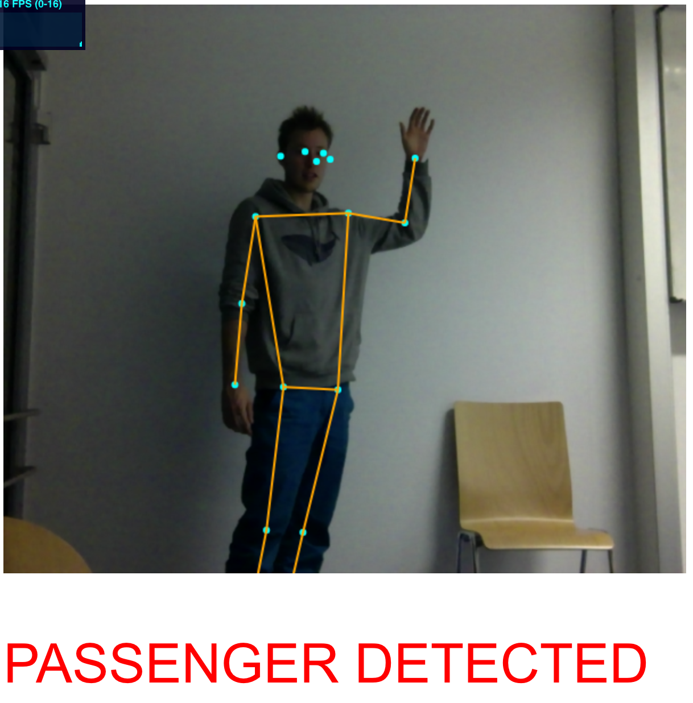
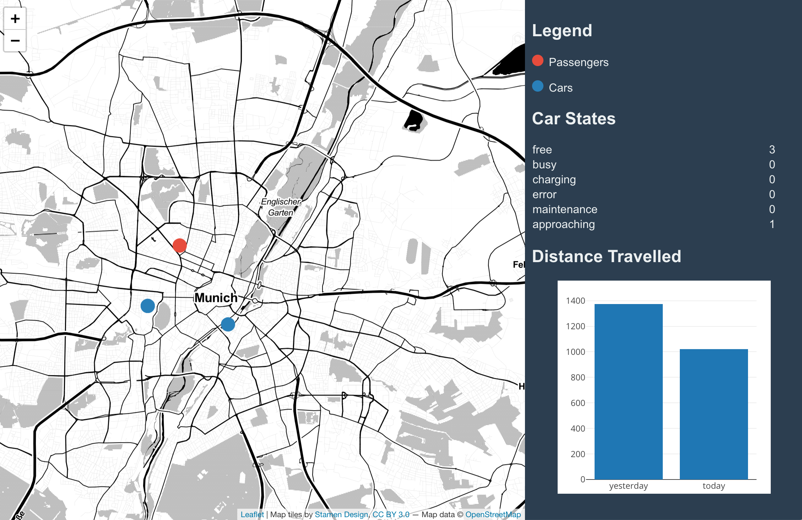

## HackaTUM 2018: Autonomous Intelligent Driving Challenge
# Swarm intelligence based taxi service with gesture recognition UI

by: [hobbeshunter](https://github.com/hobbeshunter) [whateverforever](https://github.com/whateverforever) [asakhnenko](https://github.com/asakhnenko) [t1llr1cht3r](https://github.com/t1llr1cht3r) [mowolf](https://github.com/mowolf) 

This repository hosts the project that was developed during HackaTUM 2018. The aim of the project is to improve the user experience by allowing interactions with autonomous cabs through simple gestures. The cab will detect the passenger and offer a ride. In case the cab is currently unavailable, it sends a signal to a back-end server to send the next available cab to this area.

## Installation

1. Install tmux
1. Install and make sure Docker runs
1. Clone Project
> `git clone https://github.com/mowolf/AID_hackatum_hailing_detection`
4. Start bash script
> `bash dev-setup.sh`
5. open browser: 'localhost:1234'

## Examples

## Mission & Vision

## Dependencies

### Docker
[Docker](https://www.docker.com/)

### PoseNet
Pre-trained machine learning model ported to TensorFlow.js which can recognize human poses real-time.

[GitHub Repo](https://github.com/tensorflow/tfjs-models/tree/master/posenet)

### React
React is a JavaScript library for building UIs.

[GitHub Repo](https://github.com/facebook/react)

### Leaflet
Open-source JavaScript library for interactive maps.

[GitHub Repo](https://github.com/Leaflet/Leaflet)
